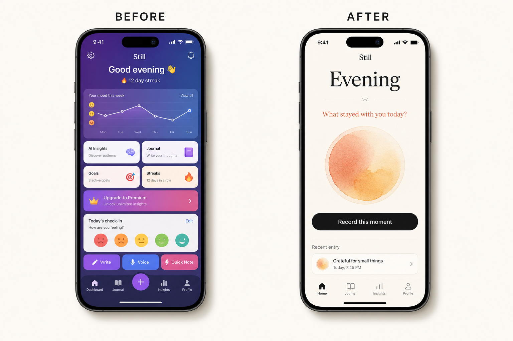

# iOS Design Art Director

[简体中文](#简体中文) · [English](#english) · [日本語](#日本語) · [한국어](#한국어) · [Español](#español) · [Français](#français)

An open-source Codex skill for Apple Design Award-level iOS product direction, experience design, art direction, and evidence-based critique.

> Independent community project. Not affiliated with or endorsed by Apple Inc. or OpenAI.

## Before & After

The same iOS mood-journaling brief, approached with and without the skill:



| Without the skill | With `ios-design-art-director` |
| --- | --- |
| Features compete for attention | One meaningful action defines the experience |
| Dashboard cards and upgrade chrome dominate | Content and emotional context lead the hierarchy |
| Generic gradients, shadows, and crowded controls | Restrained materials, semantic color, and native behavior |
| Accessibility and edge states are deferred | Legibility, touch comfort, agency, and resilience shape the concept |

**Design thesis:** Help a busy person close the day with one honest sentence, creating a quiet sense of reflection rather than another performance dashboard.

**Predictive concept score:** 52/100 before → 88/100 after. This is an illustrative art-direction example, not a measured usability result.

## 简体中文

`ios-design-art-director` 是一个面向原生 iPhone 与 iPad 体验的 Codex 技能。它让 Codex 以产品设计师和艺术总监的视角工作，不只判断界面是否“好看”，还会审视产品目的、信息架构、原生交互、视觉系统、情绪表达、无障碍、隐私责任与完整状态。

它适合用于：定义 iOS 产品方向；设计或重构页面与流程；评审截图、原型、SwiftUI 或 UIKit 界面；建立视觉与交互系统；以及按 100 分框架给出可执行、不过度抬高的设计评价。

这个技能强调基于证据做判断：涉及最新 Apple 设计语言时核验官方资料；从 Apple Design Award 获奖作品中提炼可迁移的方法，但不复制作品的视觉身份或标志性交互。

## English

`ios-design-art-director` helps Codex think like a product designer and art director for native iPhone and iPad experiences. It goes beyond surface polish to examine product purpose, information architecture, native interaction, visual systems, emotional character, accessibility, privacy, resilience, and edge states.

Use it to shape an iOS product direction, design or redesign screens and flows, critique screenshots and prototypes, review SwiftUI or UIKit interfaces, establish a coherent art direction, and produce a rigorous 100-point assessment with prioritized improvements.

The skill is evidence-led: it checks current official Apple guidance when recency matters, treats award-winner lessons as design inferences rather than requirements, and prohibits copying a winner's visual identity or signature interactions.

## 日本語

`ios-design-art-director` は、Codex がネイティブな iPhone／iPad 体験をプロダクトデザイナー兼アートディレクターの視点で考えるためのスキルです。見た目の美しさだけでなく、製品の目的、情報設計、iOS らしい操作、ビジュアルシステム、感情的な個性、アクセシビリティ、プライバシー、例外状態まで評価します。

iOS 製品の方向性策定、画面やフローの設計・再設計、スクリーンショットやプロトタイプの講評、SwiftUI／UIKit UI のレビュー、一貫したアートディレクションの構築、100 点満点の厳密な評価に利用できます。

## 한국어

`ios-design-art-director`는 Codex가 네이티브 iPhone 및 iPad 경험을 제품 디자이너이자 아트 디렉터의 관점에서 설계하도록 돕는 스킬입니다. 단순한 시각적 완성도를 넘어 제품 목적, 정보 구조, iOS다운 상호작용, 시각 시스템, 감성, 접근성, 개인정보 보호, 오류 및 예외 상태까지 검토합니다.

iOS 제품 방향 수립, 화면과 플로우의 설계·리디자인, 스크린샷과 프로토타입 비평, SwiftUI／UIKit UI 리뷰, 일관된 아트 디렉션 구축, 엄격한 100점 평가에 사용할 수 있습니다.

## Español

`ios-design-art-director` ayuda a Codex a trabajar como diseñador de producto y director de arte para experiencias nativas de iPhone y iPad. Va más allá del acabado visual y analiza el propósito, la arquitectura de información, la interacción propia de iOS, el sistema visual, el carácter emocional, la accesibilidad, la privacidad y los estados límite.

Sirve para definir la dirección de un producto iOS, diseñar o rediseñar pantallas y flujos, evaluar capturas y prototipos, revisar interfaces SwiftUI o UIKit, crear una dirección artística coherente y producir una evaluación rigurosa sobre 100 puntos.

## Français

`ios-design-art-director` aide Codex à agir comme designer produit et directeur artistique pour des expériences natives iPhone et iPad. Il ne se limite pas à l'esthétique : il examine la finalité du produit, l'architecture de l'information, les interactions propres à iOS, le système visuel, l'émotion, l'accessibilité, la confidentialité et les cas limites.

Il permet de définir la direction d'un produit iOS, concevoir ou repenser des écrans et des parcours, critiquer des captures et prototypes, évaluer des interfaces SwiftUI ou UIKit, construire une direction artistique cohérente et produire une note rigoureuse sur 100 points.

## Install

Clone the repository into your personal Codex skills directory:

```bash
git clone https://github.com/yhstef/ios-design-art-director.git ~/.codex/skills/ios-design-art-director
```

Restart Codex if the skill does not appear immediately.

## Use

Invoke it explicitly:

```text
$ios-design-art-director Review this iOS onboarding flow and give me an evidence-limited score.
```

Or describe a matching iOS product-design task and let Codex select the skill automatically.

## What is included

- `SKILL.md` — core workflow, design lens, scoring rubric, and deliverable format.
- `references/ada-intelligence.md` — a dated synthesis of official Apple guidance and recent Apple Design Award patterns.
- `agents/openai.yaml` — display metadata and a default invocation prompt.

## License

Released under the [MIT License](LICENSE).
